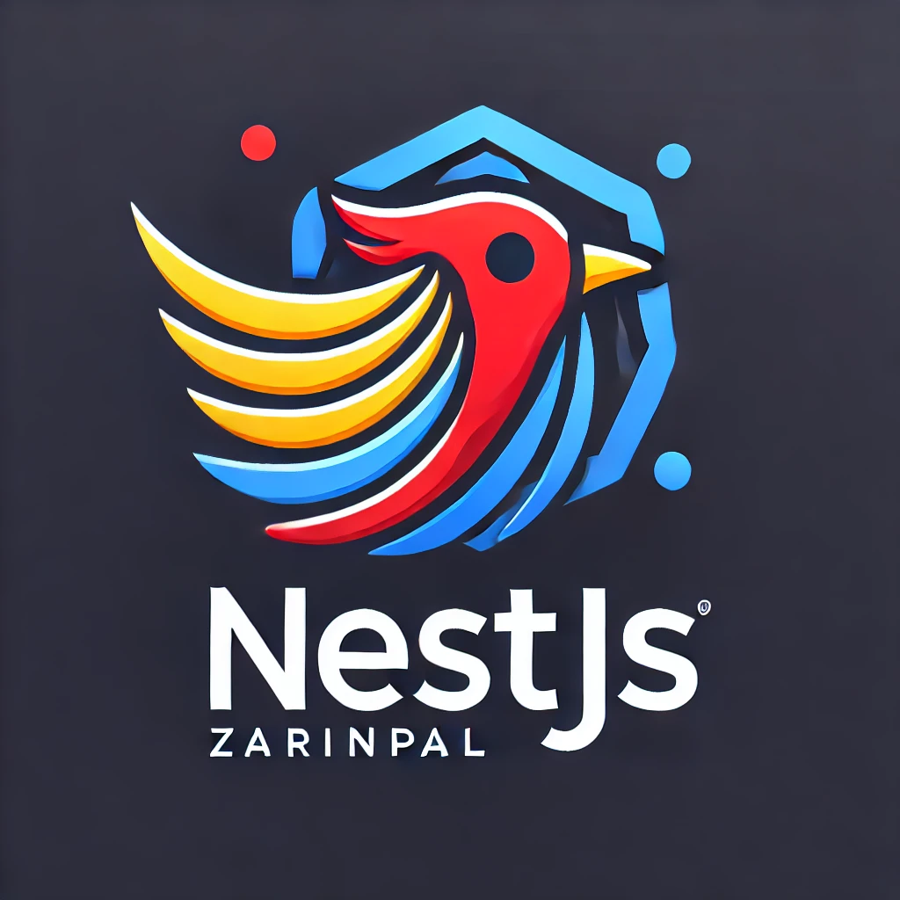

# Zarinpal Adaptor for `NestJs`.

<p align="center">
  <a href="" target="blank"></a>
</p>

For online support, you can join the Telegram group:

[](https://t.me/+LQ3nF7Dfc3xjNGU8)


[circleci-image]: https://img.shields.io/circleci/build/github/nestjs/nest/master?token=abc123def456

# Features:

[circleci-url]: https://circleci.com/gh/nestjs/nest

[](https://github.com/me-dira/zarinpal-nestjs/wiki)
[](https://github.com/me-dira/zarinpal-nestjs)
[](https://github.com/me-dira/zarinpal-nestjs)

- Easy to use.
- Light and fast.
- Specific error type (ZarinpalError).

## How to use:

The process is very simple and includes:

- Open transaction on Zarinpal.
- Generate the URL using the result and redirect the user to the Start Pay page.
- The user will be redirected after payment is done to verify the URL you specified.

---

### installation

Installation is very simple and can be done using below commands:

```bash
yarn add zarinpal-nestjs
npm install --save zarinpal-nestjs
```

### Register the module

After successful installation, you need to register `zarinpal-nestjs` module in your NestJs application:

```typescript
@Module({
  imports: [
    ZarinpalModule.register({
      // Required options:
      callBackUrl: 'https://google.com',
      merchantId: '32 character long merchant_id',
    }),
  ],
})
export class AppModule {}
```

### Inject inside the class

You can check one simple example of injecting the `service`:

```typescript
import { ZarinpalService } from 'zarinpal-nestjs';
@Controller('transaction')
export class AppController {
  constructor(
    private readonly zarinpalService: ZarinpalService,
  ) {}

```

## Open transaction & Generate Start Pay URL

As you know you need to redirect the user to the payment gate, then the user can pay the bill. After you open a transaction and get the authorization code, you can generate the URL using the `transactionOpen` result like:

```typescript
  async openTransaction(): Promise<string> {
      const transactionResult = await this.zarinpalService.openTransaction({
        amount: 1000,
        description: 'Buying a car (example)',
      });

      // https://www.zarinpal.com/pg/StartPay/A00000000000000000000000000387664294
      return this.zarinpalService.generateStartPayUrl(transactionResult);
  }
```

## Verify transaction

After the user completes the payment process, will return to the URL you pass through Module registration and you can verify them like this:

```typescript
@Get('verify')
async verifyTransaction(@Query() query: ZarinpalVerifyQueryParams) {
    const transaction = await this.appService.findTransactionByAuthority(
      query.Authority,
    );

    await this.zarinpalService.verifyTransaction({
      authority: query.Authority,
      amount: transaction.amount,
    });
}
```

## Encode & Decode Authority code

**Be Careful with using this method. experimental flag**

As you know authority codes of transactions are pretty long and it's very bad practice to store them raw. You can encode and decode them using two predefined functions. For example:

```typescript
import {
  zarinpalAuthorityEncode,
  zarinpalAuthorityDecode,
} from 'zarinpal-nestjs';

const longAuthorityCode = 'A00000000000000000000000000387664294';
const encodedAuthorityCode = zarinpalAuthorityEncode(longAuthorityCode);
const decodedEncodedAuthorityCode = zarinpalAuthorityDecode(
  encodedAuthorityCode,
);

console.log({
  encoded: encodedAuthorityCode, // 26x387664294
  decoded: decodedEncodedAuthorityCode, // A00000000000000000000000000387664294
});
```

for more information please read [Documentation](https://github.com/me-dira/zarinpal-nestjs/wiki).
